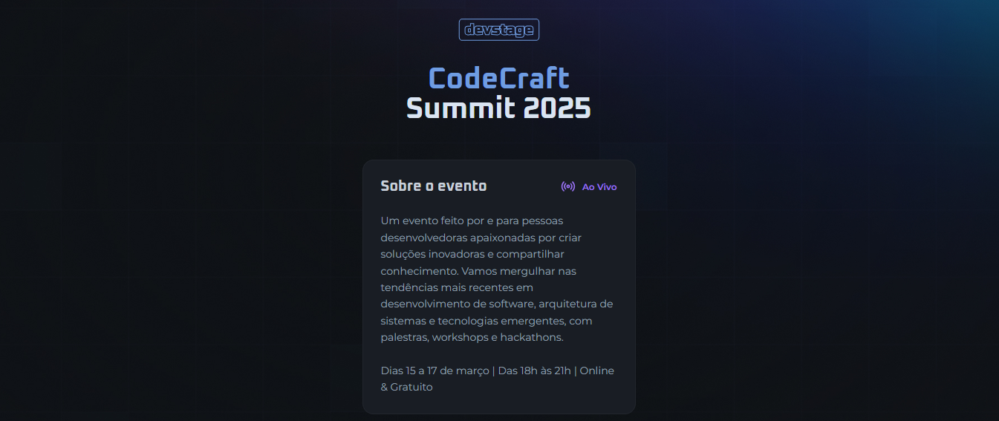
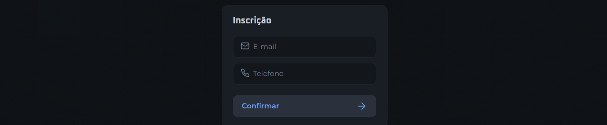
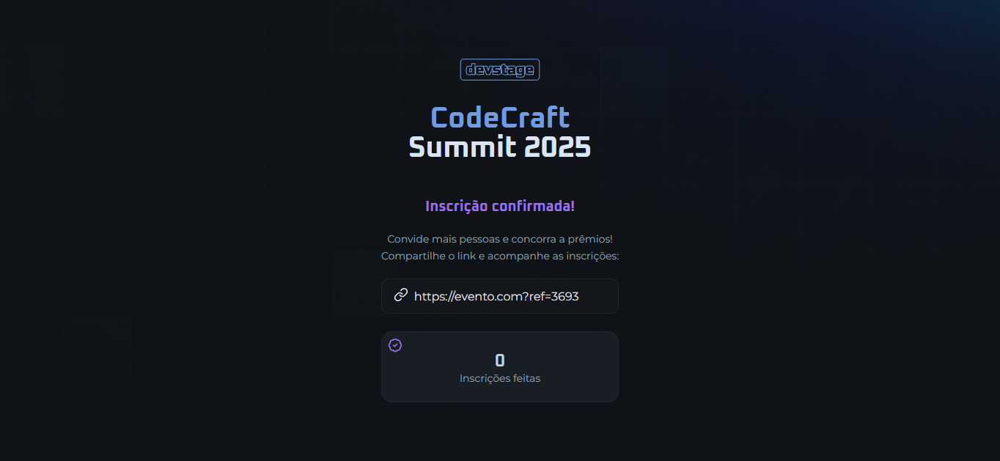

## NLW Connect 📋
**`RocketSeat`** 🚀

Este projeto é um software de inscrição e indicação para eventos. Nele, o usuário pode acessar seu ingresso, gerar seu link de convite e ter acesso ao ranking de indicações. Foi desenvolvido durante o evento NLW Connect da Rocketseat.

- Estrutura desenvolvida em **HTML** e **JavaScript**
- Estilização feita com **CSS**
- Aplicação da lógica com **JavaScript**

                                                
